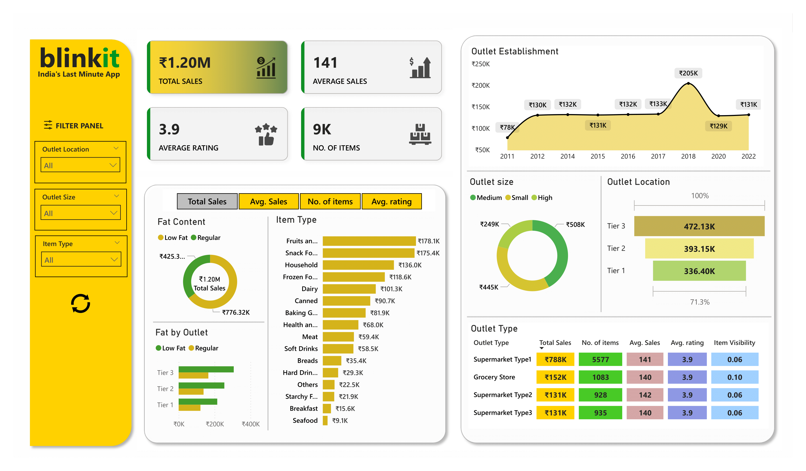

# Blinkit Sales Dashboard
This project showcases a dynamic Power BI dashboard created for analyzing sales performance across various cities and outlets.
It also shows different metrics, filtered on the amount of fat in the products, thus promoting healthy choices.

## 📁 Project Files
- `blinkit_sales.pbix` – Full interactive report
- Dataset from Kaggle   [blinkit_sales](https://www.kaggle.com/datasets/arunkumaroraon/blinkit-grocery-dataset) 
- `screenshots/` – Dashboard visuals
- [YouTube](https://youtu.be/NXUIPaj4s4o) – Walkthrough video

## 🚀 How to View
1. Download - `blinkit_sales.pbix`
2. Open using [Power BI Desktop](https://powerbi.microsoft.com/en-us/desktop/)

## 📸 Preview

